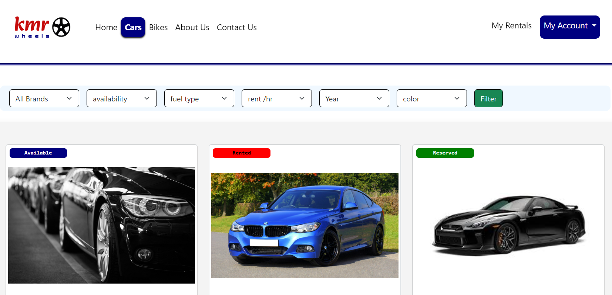
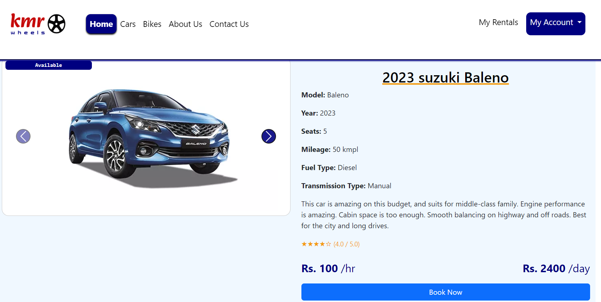
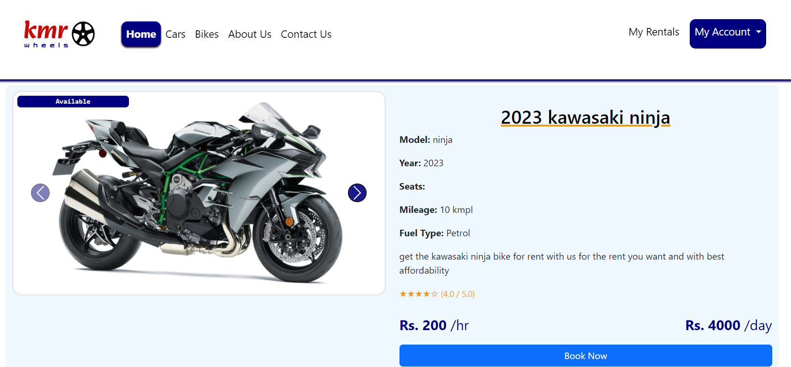
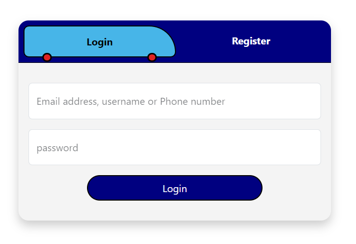
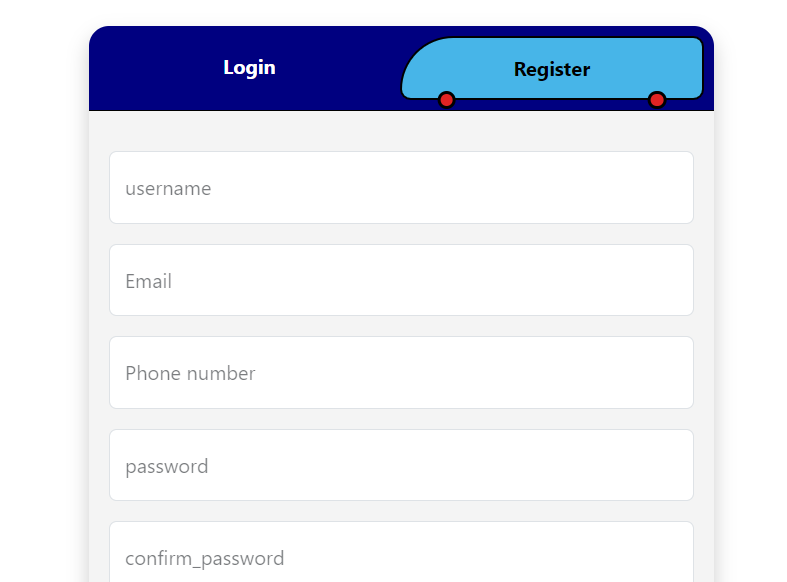

## car rental project in django
## aws s3 for storage and serving static files
## with bootstrapp ui
## with neat and fatser retrival from postgres database.

# images

### 1.detail

### 2.car rent detail page

### 3.bike rent detail page

### 4.login page

### 5.register page

